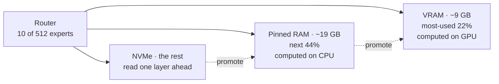

<div align="center">

# QwFN-hybrid

**A 125B¹ mixture-of-experts model at 17-26 tok/s on one 16 GB GPU and 32 GB of RAM.**

Local inference for Qwen3.8-Flash-Next (IQ3_XXS). Output checked token by token against llama.cpp.

[](LICENSE)


[Results](#results) · [Quick start](#quick-start) · [Tuning](#tuning-for-your-machine) · [How it works](#how-it-works) · [Parity](#parity)

</div>

---

A local inference engine built for this one model on consumer hardware well below the usual
recommendation (a 24 GB GPU with 96 GB of RAM). On the same machine it decodes **up to 1.9× faster** and
reads long prompts **3.8× faster** than [llama.cpp](https://github.com/ggml-org/llama.cpp), with per-token output
distributions checked against llama.cpp's.

## Results

<sub>RTX 5060 Ti 16 GB (PCIe Gen4 x8) · Core Ultra 7 265F · 32 GB DDR5 · PCIe 4 NVMe · IQ3_XXS · q8_0 KV cache. tok/s.</sub>

`llama-bench`-style numbers (pp = prompt processing, tg = text generation):

| Engine | pp512 | pp16384 | tg128 | tg128 @ 16K | tg128 + MTP |
|:---|---:|---:|---:|---:|---:|
| llama.cpp (experts on CPU) | 104 | 165 | 9.9 | 10.0 | – |
| **QwFN-hybrid** | 98 | **620** | **15.9** | **12.7** | **19.0** |

<sub>llama.cpp: `llama-bench -ot exps=CPU -fa 1 -ctk q8_0 -ctv q8_0` (ca1426903). QwFN-hybrid: `bench/llamabench.sh`,
the same token counts, pp512 after a warm-up prompt as llama-bench does, tg generated freely (greedy); mean of 2 runs.
At 16K depth, MTP drafts gained nothing on this text (12.4). Raw data: `bench/evidence/raw/llamabench/`.</sub>

Real workloads: teacher-forced replays of fixed sessions, decode tok/s with MTP, mean of 3 runs:

| Workload | **QwFN-hybrid** |
|:---|---:|
| Code | **26.4** |
| Agent | **21.3** |
| Reasoning | **21.8** |
| Short chat | **18.9** |
| Long context (21K) | **17.7** |
| Server, end to end (4 requests)² | **21.4** |

Shared prefixes (system prompt, tools) are restored from a snapshot in milliseconds instead of being
read again. In an OpenCode agentic-coding task, every run solved the bug.

## Quick start

> Needs Linux, an NVIDIA GPU with 16 GB, CUDA, CMake, Ninja, liburing and ~80 GB of disk. The command below uses
> ~24 GB of free RAM; less works (smaller `--ram`), more is faster.

```bash
# 1. Model (IQ3_XXS, 2 shards, 76 GB) and the MTP draft head (2.8 GB); -c resumes
# MODEL_URL: where the GSQ-RCO IQ3_XXS shards are hosted (link to be added)
mkdir -p models && cd models
wget -c MODEL_URL/Qwen3.8-Flash-Next-GSQ-RCO-IQ3_XXS-00001-of-00002.gguf
wget -c MODEL_URL/Qwen3.8-Flash-Next-GSQ-RCO-IQ3_XXS-00002-of-00002.gguf
wget -c https://huggingface.co/unsloth/Qwen3.8-Flash-Next-GGUF/resolve/main/MTP/mtp-Qwen3.8-Flash-Next-shared-Q8_0.gguf
cd ..

# 2. Build (fetches and patches ggml/llama.cpp next to the repo, then builds both)
git clone https://github.com/thomaskleiven/QwFN-hybrid
QwFN-hybrid/scripts/build.sh

# 3. Serve an OpenAI- and Anthropic-compatible API on :8080 (pass only the first shard)
QwFN-hybrid/build/qwfn-server models/Qwen3.8-Flash-Next-GSQ-RCO-IQ3_XXS-00001-of-00002.gguf \
  --mtp models/mtp-Qwen3.8-Flash-Next-shared-Q8_0.gguf \
  --ctx 73728 --kv q8_0 --threads 5 --ram 19 --ram-frac 0.95
```

Then point any OpenAI-compatible client (OpenCode, aider, …) at `http://localhost:8080/v1`:

```bash
curl localhost:8080/v1/chat/completions -H 'Content-Type: application/json' \
  -d '{"messages":[{"role":"user","content":"Hello"}],"max_tokens":200}'
```

## Tuning for your machine

The flags above fit the machine in [Results](#results). On other hardware, start here:

| Flag | Rule of thumb |
|:---|:---|
| `--ram GB` | RAM expert tier: free RAM minus ~5 GB, no upper limit. **The biggest single speed factor.** Default 8. |
| `--threads N` | Threads for CPU experts: P-cores minus 2-3 (5 of 8 here). More is slower. |
| `--ctx N` | Context length. A longer context takes VRAM from the expert tier. |
| NVMe | Prompt reading streams the experts that are not in RAM, so a fast drive that holds its read rate across the whole file helps most there. |

## How it works

The model is 76 GB; the machine has 16 GB of VRAM and 32 GB of RAM. It still runs fast because each token
uses only 10 of 512 experts per layer, and a small set of experts gets most of the traffic. Experts live in three tiers:



About 98% of expert lookups hit VRAM or RAM. Each layer is then a serial chain: GPU layer → CPU experts →
NVMe wait → next layer. On this hardware, that chain sets the speed, so the hybrid shortens every link:

| Link | Change |
|:---|:---|
| CPU experts | Persistent thread pool; only the routed (expert, token) pairs; work stealing in ggml. Over PCIe Gen4 x8, uploading an expert costs as much as computing it on 5 cores. |
| Every layer | The model's own MTP head drafts 2 tokens that are verified together, so each layer's fixed cost covers up to 3 tokens. |
| Attention | Projections batched across those tokens; the sparse-attention cache read raw by flash attention, as llama.cpp does. |
| NVMe | Predicted reads submitted after the urgent ones. |
| Prompt reading | One pass over the experts per 32K-token batch, read 2-4 deep, which keeps this drive near its sequential rate. |
| Sessions | Snapshots restore an agent's shared prefix instead of re-reading it. |

Everything tried, kept or rejected, with measurements: [`docs/DECISIONS.md`](docs/DECISIONS.md).

## Parity

Every scenario (code, agent, reasoning, short chat, long context) is fed identical tokens and scored
per token against llama.cpp decoding one token at a time: NLL shift, per-token spread, top-k KL and
top-1 agreement, with a gate registered before the runs.

**Release build: passes 4 of 5 scenarios** (e.g. code: NLL shift 0.0003, 99.9% top-1 agreement).
Reasoning fails on NLL shift only (0.0031 vs a 0.0021 limit): traced to rounding from which experts
run on GPU vs CPU, not a code error, and within the limit (−0.0014) on a 3000-token rerun, with a
small lean of about −0.001 still visible · details in [`docs/PARITY.md`](docs/PARITY.md) · data in `bench/evidence/raw/final6/`

<details>
<summary><b>Reproduce the benchmarks</b></summary>

```bash
cp bench/env.example bench/local.env      # set model and reference paths
bench/replay.sh mytest                    # speed + NLL on one scenario
bench/evidence/campaign.sh all OUT        # full replay + parity campaign against llama.cpp
bench/evidence/null_runs.sh NULL          # llama.cpp's own null spread (gate v5)
bench/evidence/summarize.py OUT --null NULL   # tables + parity gate (non-zero exit on failure)
bench/golden.sh capture DIR full          # record bit-exact reference outputs ...
bench/golden.sh check DIR full            # ... and verify a change reproduces them byte for byte
```

</details>

<details>
<summary><b>Code quality</b></summary>

The C++ follows strict coding rules (functions ≤ 60 lines,
≥ 2 always-on assertions per function, bounded loops, checked returns and inputs, no recursion, no
function-like macros, zero warnings). Deviations forced by ggml / cpp-httplib are documented.
`scripts/check_rules.sh` enforces it; see [`docs/CODING_RULES.md`](docs/CODING_RULES.md).

</details>

<details>
<summary><b>Limitations</b></summary>

- Tuned and measured on one machine. Other hardware needs its own `--ram` and `--threads`.
- One model architecture (`qwen4exp` GGUF). NVIDIA CUDA only.
- Every prompt above 512 tokens streams the experts that are not in RAM, so a 1K-token tool
  result costs ~7 s on a warm server, and a 4K-token first request ~11 s. The drive's read rate
  sets that ([details](docs/DECISIONS.md#prompt-reading-is-bounded-by-the-drive)).
- Deterministic run to run, but not bit-identical to llama.cpp: parity means matching distributions.

</details>

---

<sub>¹ The model card's count. llama.cpp reports 177B because it also counts the 51B-parameter per-layer
embedding table (read from disk per token); about 3B parameters are active per token.</sub>

<sub>² Measured on the previous build (`bench/evidence/raw/final4/`); the replays above did not get slower since.</sub>

<sub>Apache-2.0 · see <a href="LICENSE">LICENSE</a> and <a href="NOTICE">NOTICE</a>. Built on
<a href="https://github.com/Apolog1ze-Dev/QwFNfer">QwFNfer</a>, <a href="https://github.com/ggml-org/llama.cpp">ggml/llama.cpp</a>
and <a href="https://huggingface.co/unsloth/Qwen3.8-Flash-Next-GGUF">Unsloth's GGUF quantization</a>.
Model: Qwen3.8-Flash-Next by the Qwen team.</sub>
